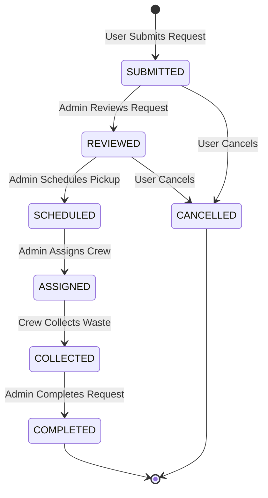
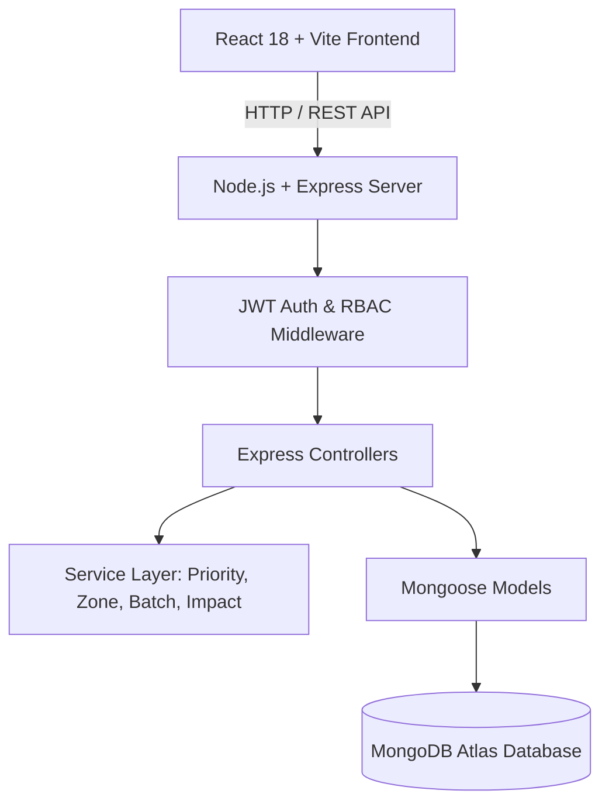

# ♻️ WasteConnect

### Request. Track. Collect.

WasteConnect is a modern, full-stack MERN waste collection and recycling management platform designed to simplify responsible waste disposal for residents while providing operations teams with smart priority scoring, collection zone intelligence, smart collection batching, and environmental impact analytics.

---

[🚀 Live Demo](https://wasteconnect-bfno.onrender.com) &nbsp;|&nbsp; [💻 GitHub Repository](https://github.com/maheshkoli4206/WasteConnect.git) &nbsp;|&nbsp; [📋 API Documentation](#-api-overview)

---

## 📌 Project at a Glance

WasteConnect bridges the gap between household waste generation and operational collection teams. It allows residents to receive waste-specific disposal guidance, schedule pickups, and track request lifecycles in real-time. Operations teams gain access to an operational control center featuring deterministic priority scoring, collection zone grouping, smart batching, and environmental impact monitoring.

### Core Capabilities Matrix

| Functional Area | Capability |
| :--- | :--- |
| **Resident Services** | Schedule, track, and manage household waste pickup requests |
| **Disposal Guidance** | Material-specific disposal instructions, DOs/DON'Ts, and safety notes |
| **Pickup Scheduling** | Flexible date selection and morning/afternoon time slot booking |
| **Visual Tracking** | Real-time status timeline tracking (`SUBMITTED` ➔ `COMPLETED`) |
| **Operations Management** | Centralized admin dashboard for queue management and crew dispatch |
| **Collection Intelligence** | Automated priority scoring, collection zone assignment, and smart batching |
| **Impact Visibility** | Environmental metrics estimating diverted waste (kg) and completion rates |
| **Cloud Deployment** | Production containerized deployment on Render backed by MongoDB Atlas |

---

## ❓ Problem Statement

Proper waste disposal and collection management face significant operational challenges:

1. **Lack of Resident Awareness**: Households often lack clear guidance on how to properly segregate and prepare specialized waste materials (such as E-Waste, Hazardous chemicals, or Glass) prior to collection.
2. **Unorganized Pickup Requests**: Traditional pickup requests are submitted through fragmented channels without standardized location, time, or material descriptions.
3. **Operational Bottlenecks for Collection Teams**: Collection management teams lack tools to prioritize high-risk/hazardous requests, group pickups geographically by zone, or identify requests that can be collected together on the same date.

---

## 💡 The Solution

WasteConnect delivers an end-to-end digital operations platform that streamlines the complete waste collection lifecycle:

- **Centralized Pickup Requests**: Digital request creation specifying category, quantity, address, and date/time slot.
- **Material-Specific Guidance**: Instant preparation rules (DOs and DON'Ts) tailored to each waste category.
- **Explainable Priority Scoring**: Server-side scoring engine that evaluates material risk, description urgency, and scheduling to assign `LOW`, `MEDIUM`, or `HIGH` priority.
- **Collection Zone Intelligence**: Deterministic location keyword processing that organizes addresses into operational zones (`Zone A`, `Zone B`, `Zone C`, `Zone D / General`).
- **Smart Collection Batching**: Operational grouping of active requests sharing identical collection zones and pickup dates.
- **Environmental Impact Analytics**: Real-time computation of waste diverted from landfills based on completed collections.

---

## 🌟 Why WasteConnect?

```
┌───────────────────────────┐    ┌───────────────────────────┐
│   ♻️ Responsible Disposal   │    │ 📦 Organized Requests     │
│ Waste-specific preparation│    │ Standardized scheduling   │
│ instructions for residents│    │ and location booking      │
└─────────────┬─────────────┘    └─────────────┬─────────────┘
              │                                │
              └───────────────┬────────────────┘
                              ▼
┌────────────────────────────────────────────────────────────┐
│          🧠 Explainable Collection Intelligence            │
│   Automated Priority • Operational Zones • Smart Batches   │
└─────────────────────────────┬──────────────────────────────┘
                              │
              ┌───────────────┴────────────────┐
              ▼                                ▼
┌───────────────────────────┐    ┌───────────────────────────┐
│ 📊 Operational Visibility │    │ 🌱 Environmental Impact   │
│ Real-time admin queue and │    │ Track diverted waste (kg) │
│ lifecycle status updates  │    │ and completion rates      │
└───────────────────────────┘    └───────────────────────────┘
```

- **♻️ Responsible Disposal**: Empowers residents with actionable preparation instructions to reduce contamination before collection.
- **📦 Organized Pickup Requests**: Eliminates unstructured request channels by standardizing time slots, locations, and descriptions.
- **📊 Operational Visibility**: Gives management full visibility over request counts, priority alerts, and crew status transitions.
- **🧠 Explainable Collection Intelligence**: Transparent rules engine that explains *why* a request received high priority or which zone it belongs to.
- **🌱 Environmental Impact Visibility**: Translates completed collections into clear sustainability metrics.

---

## 🔄 User Workflow

```
Register / Login
       │
       ▼
Select Waste Category ➔ View Disposal Guidance & DOs/DON'Ts
       │
       ▼
Enter Location & Preferred Time Slot
       │
       ▼
Submit Request ➔ Server Computes Priority & Collection Zone
       │
       ▼
Track Lifecycle Status Timeline (SUBMITTED ➔ COMPLETED)
```

1. **User Registration & Authentication**: Secure account creation and JWT login.
2. **Category Selection**: Choose from 8 waste categories (E-Waste, Plastic, Paper, Glass, Organic, Metal, Hazardous, Other).
3. **Disposal Preparation**: Read material-specific guidance, DOs/DON'Ts, and environmental notes.
4. **Pickup Scheduling**: Specify pickup address, future date, and time slot window.
5. **Request Submission**: System creates request, computes priority score, and assigns an operational collection zone.
6. **Real-Time Tracking**: Monitor progress through a 6-stage visual status timeline (`SUBMITTED` ➔ `REVIEWED` ➔ `SCHEDULED` ➔ `ASSIGNED` ➔ `COLLECTED` ➔ `COMPLETED`).
7. **Request Management**: Cancel eligible requests (`SUBMITTED` or `REVIEWED`) or view historical records.

---

## ⚙️ Admin Operations Workflow

```
Admin Login ➔ Operational Control Dashboard
       │
       ▼
Review Real-Time Statistics & High-Priority Alerts
       │
       ▼
Search Queue & Filter by Category / Status / Priority / Zone
       │
       ▼
Inspect Priority Factors & Assigned Collection Zone
       │
       ▼
Analyze Smart Collection Batches (Zone + Pickup Date)
       │
       ▼
Update Status & Dispatch Notes ➔ Monitor Environmental Impact
```

1. **Admin Authorization**: Secure access control restricted to `ADMIN` role users.
2. **Dashboard Overview**: Inspect live counts for Total, Pending, Scheduled, Completed, and High Priority pickups.
3. **Zone Breakdown**: View request distributions across Collection Zones (`Zone A` - `Zone D`).
4. **Smart Batch Review**: Inspect suggested collection batches grouping requests by identical zone and date.
5. **Multi-Criteria Filtering**: Filter queue by category, status, priority level, or operational zone.
6. **Lifecycle Management**: Advance request status forward and append collection crew dispatch notes.
7. **Environmental Impact Monitoring**: Track cumulative diverted waste weight and overall completion percentage.

---

## 🚀 Key Features

### 👤 Resident Features
- **Account Management**: Registration, JWT login, profile view, and persistent sessions.
- **Smart Disposal Advisor**: Guidance cards showing preparation steps, DOs/DON'Ts, safety notes, and environmental notes.
- **Pickup Scheduling**: Easy-to-use form with date picker and morning/afternoon slot selection.
- **Explainable Priority Rating**: Instant feedback on request priority level (`LOW`, `MEDIUM`, `HIGH`) and contributing score factors.
- **Visual Status Timeline**: Stepper timeline showing current stage from submission to completion.
- **Request Cancellation**: Self-service cancellation permitted for `SUBMITTED` or `REVIEWED` requests.

### 🛠️ Admin Operations Features
- **Operational Control Center**: Centralized dashboard backed by MongoDB aggregation pipelines.
- **Collection Zone Overview**: Real-time status breakdown per collection zone.
- **Smart Collection Batching**: Automated batch suggestions highlighting high-attention clusters.
- **Environmental Impact Dashboard**: Diverted waste calculation (kg) based on category weight estimates.
- **Queue Search & Filtering**: Multi-field search (ID, Category, Address) and combined multi-filter dropdowns.
- **Status Lifecycle Control**: Strict lifecycle transitions with validation guarding against invalid backward status steps.

---

## 🧠 Smart Collection Intelligence

WasteConnect includes five core intelligent services built using transparent, deterministic business logic:

### 1. Smart Disposal Advisor
Provides waste-category-specific disposal methods, recommended DOs, items to avoid (DON'Ts), environmental notes, and safety instructions for all 8 supported material categories.

### 2. Explainable Smart Collection Priority
Evaluates waste category risk (e.g., Hazardous/E-Waste $\rightarrow$ higher base score), keyword urgency in descriptions (e.g., "leaking", "urgent", "broken"), and pickup timing to calculate a numerical score (0-100) and priority rating (`LOW`, `MEDIUM`, `HIGH`). All contributing score reasons are stored and displayed transparently.

### 3. Collection Zone Intelligence
Organizes pickup locations into operational collection zones (`Zone A`, `Zone B`, `Zone C`, `Zone D / General`) based on deterministic address keyword processing, giving operations teams geographic visibility without external map APIs.

### 4. Smart Collection Batching
Identifies active, non-terminal requests (`SUBMITTED`, `REVIEWED`, `SCHEDULED`, `ASSIGNED`) that share the exact same collection zone and pickup date. Generates suggested collection batches with high-attention indicators for clusters containing multiple high-priority items.

### 5. Environmental Impact Dashboard
Computes estimated diverted waste weight (in kg) from completed collections using transparent category weight defaults (Plastic: 2.0kg, Paper: 1.5kg, Glass: 3.0kg, Metal: 2.5kg, Organic: 2.0kg, E-Waste: 1.5kg, Other: 1.0kg) alongside an overall completion rate percentage.

---

## 🔄 Request Lifecycle State Machine



- **Cancellation Rule**: Users may cancel requests only while in `SUBMITTED` or `REVIEWED` status. Once `SCHEDULED` or beyond, cancellation is disabled.
- **Terminal States**: `COMPLETED` and `CANCELLED` are terminal states that cannot be modified.

---

## 🏗️ System Architecture



### Authentication & Access Control Architecture
- **Stateless JWT Authentication**: Tokens issued upon login stored in `localStorage` and sent via `Authorization: Bearer <token>` headers.
- **Role-Based Access Control (RBAC)**: `protect` middleware verifies JWT authenticity; `authorize('ADMIN')` middleware restricts operational endpoints to Admin users.
- **Ownership Verification**: Resource-level checks ensure users can view and cancel only their own request documents (`403 Forbidden` returned for unauthorized access attempts).

---

## 💻 Tech Stack

| Layer | Technologies | Description |
| :--- | :--- | :--- |
| **Frontend** | React 18, Vite, React Router v6 | Single Page Application with dynamic client-side routing |
| **Styling** | Bootstrap 5, Bootstrap Icons, Custom CSS | Modern environmental palette with responsive card/table layouts |
| **Backend** | Node.js, Express.js | RESTful Web API with middleware request processing |
| **Database** | MongoDB, Mongoose | Document database with schema validation and aggregation pipelines |
| **Authentication**| JWT (jsonwebtoken), bcryptjs | Secure password hashing and stateless token authorization |
| **Containerization**| Docker | Multi-stage production container build |
| **Cloud Hosting** | Render, MongoDB Atlas | Automated container deployment backed by managed MongoDB Atlas |

---

## 📁 Project Structure

```text
WasteConnect/
├── client/                     # React + Vite Frontend Application
│   ├── src/
│   │   ├── components/         # Reusable UI components (Navbar, Footer, Badges, Timeline)
│   │   ├── context/            # React AuthContext for global user state
│   │   ├── pages/              # Page components (Landing, Login, Register, Dashboards, Requests)
│   │   ├── routes/             # ProtectedRoute wrapper component
│   │   ├── services/           # Axios API client configuration
│   │   ├── App.jsx             # Main router configuration
│   │   ├── index.css           # Custom environmental CSS design system
│   │   └── main.jsx            # React application entry point
│   ├── index.html              # HTML shell
│   ├── package.json            # Frontend dependencies
│   └── vite.config.js          # Vite configuration with API dev proxy
├── server/                     # Node.js + Express Backend API
│   ├── config/                 # Database connection configuration (db.js)
│   ├── controllers/            # Request handlers (auth, categories, requests, admin)
│   ├── middleware/             # Authentication & authorization middleware (auth.js)
│   ├── models/                 # Mongoose schemas (User, WasteCategory, WasteRequest)
│   ├── routes/                 # Express API routes (auth, categories, requests, admin)
│   ├── seed/                   # Idempotent database seed script (seedData.js)
│   ├── services/               # Intelligence services (priority, zone, batch, impact)
│   ├── package.json            # Backend dependencies
│   └── server.js               # Express application entry point & static file serving
├── Dockerfile                  # Multi-stage Docker production build
├── package.json                # Root monorepo scripts
├── .env.example                # Template for environment configuration
└── README.md                   # Project documentation
```

---

## 📡 REST API Overview

### Authentication Endpoints
| Method | Endpoint | Access | Description |
| :--- | :--- | :--- | :--- |
| `POST` | `/api/auth/register` | Public | Register a new user or admin account |
| `POST` | `/api/auth/login` | Public | Authenticate credentials and return JWT token |
| `GET` | `/api/auth/me` | Private | Fetch logged-in user profile details |

### Waste Category Endpoints
| Method | Endpoint | Access | Description |
| :--- | :--- | :--- | :--- |
| `GET` | `/api/categories` | Public | Fetch all waste categories and disposal guidance |

### User Request Endpoints
| Method | Endpoint | Access | Description |
| :--- | :--- | :--- | :--- |
| `POST` | `/api/requests` | User | Create a new pickup request (auto-assigns Priority & Zone) |
| `GET` | `/api/requests/my` | User | Get all requests submitted by the logged-in user |
| `GET` | `/api/requests/:id` | User/Admin | Get detailed request information and status timeline |
| `PATCH`| `/api/requests/:id/cancel` | User | Cancel a request (`SUBMITTED` or `REVIEWED` state only) |

### Admin Operations & Intelligence Endpoints
| Method | Endpoint | Access | Description |
| :--- | :--- | :--- | :--- |
| `GET` | `/api/admin/statistics` | Admin | Get aggregate counts (Total, Pending, Scheduled, Completed, High Priority) |
| `GET` | `/api/admin/zones` | Admin | Get operational Collection Zone statistics breakdown |
| `GET | `/api/admin/batches` | Admin | Get suggested collection batches grouped by zone and pickup date |
| `GET` | `/api/admin/impact` | Admin | Get environmental impact metrics and category breakdown |
| `GET` | `/api/admin/requests` | Admin | Get queue of all requests with search and multi-criteria filters |
| `GET` | `/api/admin/requests/:id` | Admin | Get admin view of a specific request |
| `PATCH`| `/api/admin/requests/:id/status` | Admin | Update request status, priority score, and crew dispatch notes |

---

## 🔒 Security & Data Privacy

- **Password Hashing**: User passwords are securely hashed using `bcryptjs` before storage in MongoDB.
- **JWT Authorization**: Stateless JSON Web Tokens verify user identities on all protected endpoints.
- **Role Guards**: Admin endpoints are strictly protected by role authorization middleware (`authorize('ADMIN')`).
- **Resource Ownership Validation**: Users are prohibited from viewing or cancelling pickup requests owned by other users (`403 Forbidden`).
- **Environment Variable Secrets**: Sensitive values (`MONGODB_URI`, `JWT_SECRET`) are loaded strictly from environment variables.
- **Git Protection**: `.gitignore` prevents local `.env` files, build artifacts, and dependencies from being committed.

```env
# Server Environment Configuration (.env.example)
PORT=5000
NODE_ENV=development
MONGODB_URI=mongodb://127.0.0.1:27017/wasteconnect
JWT_SECRET=your_jwt_secret_key_here
```

---

## 🛠️ Local Setup & Quickstart

### Prerequisites
- Node.js (v18+ recommended)
- npm or yarn

### 1. Clone Repository
```bash
git clone https://github.com/maheshkoli4206/WasteConnect.git
cd WasteConnect
```

### 2. Install Dependencies
```bash
npm run install:all
```

### 3. Configure Environment Variables
Copy `.env.example` to `server/.env`:
```bash
cp .env.example server/.env
```

### 4. Seed Seed Data (Optional)
To populate initial demo users, waste categories, and sample requests:
```bash
npm run seed
```
*(Note: If a local MongoDB server is not running, the seed script will automatically launch an in-memory MongoDB server for instant out-of-the-box demoing!)*

### 5. Start Development Servers
```bash
npm run dev
```
Open your browser and navigate to `http://localhost:3000`.

---

## ✅ Autonomous QA & Verification Summary

The application has undergone rigorous automated end-to-end testing and verification:

| Test Area | Status | Result |
| :--- | :---: | :--- |
| **Live Availability** | **PASS** | Live Root, `/api/health`, and `/api/categories` online |
| **User Authentication** | **PASS** | Registration, Login, Token generation, and 401 Guards verified |
| **Admin Authentication** | **PASS** | Admin Login and 403 Non-Admin Access Guards verified |
| **User Pickup Workflow** | **PASS** | Form validation, Priority calculation, and Zone assignment verified |
| **Ownership Security** | **PASS** | Cross-user data access prevented with 403 Forbidden |
| **Admin Operations** | **PASS** | Multi-criteria filtering, search, and queue management verified |
| **Status Lifecycle** | **PASS** | Forward transitions and invalid backward transition guards verified |
| **Smart Intelligence** | **PASS** | Priority reasons, Zones, Smart Batches, and Impact metrics verified |
| **Database Persistence** | **PASS** | Live MongoDB Atlas persistence verified across browser reloads |
| **SPA Routing** | **PASS** | Express wildcard fallback handles direct client route refreshes |
| **Production Build** | **PASS** | Vite production client build completed with **0 errors** |

---

## 🌐 Live Production Demo

- **Live URL**: [https://wasteconnect-bfno.onrender.com](https://wasteconnect-bfno.onrender.com)
- **Deployment Platform**: Render (Docker Runtime)
- **Database**: MongoDB Atlas Managed Database

---

## 🔑 Demo Access Credentials

| Role | Email | Password | Scope / Permissions |
| :--- | :--- | :--- | :--- |
| **Resident (User)** | `user@wasteconnect.org` | `User123!` | User Dashboard, Pickup Creation, Status Tracking |
| **Operations (Admin)** | `admin@wasteconnect.org` | `Admin123!` | Admin Control Center, Collection Zones, Batches, Impact Dashboard |

*(Convenient 1-click autofill buttons are available on the Login page for rapid evaluation!)*

---

## 🔮 Limitations & Future Scope

While WasteConnect provides a complete hackathon MVP feature set, potential future enhancements include:

- **Collection Crew Mobile App**: Dedicated mobile interface for field collection drivers to update pickup statuses on the go.
- **Push & SMS Notifications**: Real-time SMS or push alerts when a collection crew is en route to a pickup address.
- **Interactive Mapping**: Visual GIS map overlays displaying collection zones and driver route optimizations.

---

## 📄 License
MIT License. Built for the WasteConnect Hackathon.
